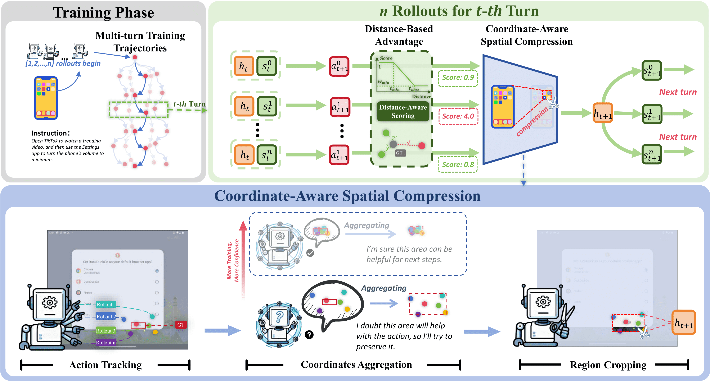

# Compress to Focus: Efficient Coordinate Compression for Policy Optimization in Multi-Turn GUI Agents

<!-- 徽章区域：显得专业且信息丰富 -->
[](https://HiThink-Research.github.io/CCPO/)
[](https://arxiv.org/pdf/2601.11631)
[](https://opensource.org/licenses/MIT)
[](https://www.python.org/downloads/release/python-3120/)
[](https://pytorch.org/)
[](https://huggingface.co/HiThink-Research/CCPO-7B-3AO-AITW/tree/main)

<!-- **[Your Name]**, **[Co-author Name]**, ... -->
**Yurun Song\*, Jiong Yin\*, Rongjunchen Zhang, Ian Harris**

<!-- **[Institution Name]** -->


## 🔥 News
- **[2026-01-12]** 🚀 Code and pre-trained models are released!
- **[2026-01-XX]** 📄 Our paper "Compress to Focus: Efficient Coordinate Compression for Policy Optimization in Multi-Turn GUI Agents" is now available on [arXiv](https://arxiv.org/pdf/2601.11631).


## 🚀 Introduction

The official implementation of the paper "Compress to Focus: Efficient Coordinate Compression for Policy Optimization in Multi-Turn GUI Agents". 

> **Abstract:** *Multi-turn GUI agents enable complex task completion through sequential decision-making, but suffer from severe context inflation as interaction history accumulates. Existing strategies either sacrifice long-term context via truncation or compromise spatial structure through token pruning. In this paper, we propose Coordinate Compression Policy Optimization (CCPO), an efficient policy optimization framework that couples visual compression with policy optimization for multi-turn GUI agents. CCPO introduces Coordinate-Aware Spatial Compression (CASC), which aggregates coordinates from multiple rollouts to capture target-relevant regions and progressively narrow historical attention around key visual areas. From interactions across rollouts, CASC adaptively constructs attention boundaries that concentrate computation on the most informative regions of the scene. We further design a Distance-Based Advantage that provides fine-grained learning signals based on distance rather than binary correctness, improving both grounding accuracy and compression quality. Extensive experiments demonstrate that CCPO achieves SOTA performance across four benchmarks with up to 55% token compression and 3.8$\times$ training speedup.*

### 📈 Method Overview

*Overview of the CCPO framework.*

### ✨ Key Features
- **Efficient Compression (CASC)**: Aggregates spatial coordinates to achieve up to **60% token reduction** without losing critical context.
- **Distance-Based Advantage**: Provides fine-grained learning signals based on spatial distance, significantly boosting grounding accuracy.
- **Training Acceleration**: Delivers **3.5x–4.8x speedup** and 16% lower TFLOPS compared to standard RL baselines.
- **SOTA Performance**: Top-tier results across 4 major benchmarks: **Android Control, GUI Odyssey, Mind2Web, and AITW**.
- **Coupled Optimization**: A unified framework that co-optimizes visual focusing and policy decision-making.


## 🛠️ Installation

### Requirements
- Linux
- Python 3.12+
- PyTorch 2.7+
- CUDA 12.8+
- Please refer to [requirements.txt](requirements.txt) for other dependencies.

### Setup
```bash
# Clone the repository
git clone https://github.com/HiThink-Research/CCPO.git
cd CCPO

# Create a conda environment
conda create -n ccpo python=3.12
conda activate ccpo

# Install dependencies
pip install torch torchvision --index-url https://download.pytorch.org/whl/cu128
pip install -r requirements.txt
```

## 📂 Data Preparation

We evaluate CCPO on four major benchmarks: **Android Control**, **GUI Odyssey**, **Mind2Web**, and **AITW**, please organize the data as follows:

```
data/
├── android_control/
├── gui_odyssey/
├── mind2web/
└── aitw/
```

---

## 🏃 Usage
### 1. SFT Training
We first perform Supervised Fine-Tuning (SFT) on **Qwen2.5-VL** as the warm-up stage.

### 2. CCPO Training
Then we train the CCPO model with the following command:

```bash
cd CCPO
bash scripts/train_CCPO_aitw_7B.sh
```

### 2. Evaluation
To evaluate the pre-trained model:

```bash
cd ../evaluation
python evaluation_aitw.py \
    --save_path path/to/save/results \
    --model_path path/to/model \
    --his_num 4
```

---

## 📊 Model Zoo

We provide pre-trained models (3B and 7B) for reproduction.

| Dataset | CCPO-3B | CCPO-7B |
| :--- | :---: | :---: |
| **AITW** | [Download](https://huggingface.co/HiThink-Research/CCPO-3B-3AO-AITW) | [Download](https://huggingface.co/HiThink-Research/CCPO-7B-3AO-AITW/tree/main) |

---

## 📝 Citation

If you find our work useful for your research, please consider citing:

```bibtex
@misc{song2026compressfocusefficientcoordinate,
      title={Compress to Focus: Efficient Coordinate Compression for Policy Optimization in Multi-Turn GUI Agents}, 
      author={Yurun Song and Jiong Yin and Rongjunchen Zhang and Ian G. Harris},
      year={2026},
      eprint={2601.11631},
      archivePrefix={arXiv},
      primaryClass={cs.CV},
      url={https://arxiv.org/abs/2601.11631}, 
}
```

## 🙏 Acknowledgement

This project is built upon [UI-S1](https://github.com/X-PLUG/MobileAgent/tree/main/UI-S1), [SimpAgent](https://github.com/JiuTian-VL/SimpAgent), and [verl-agent](https://github.com/langfengQ/verl-agent). We thank the authors for their great code.
